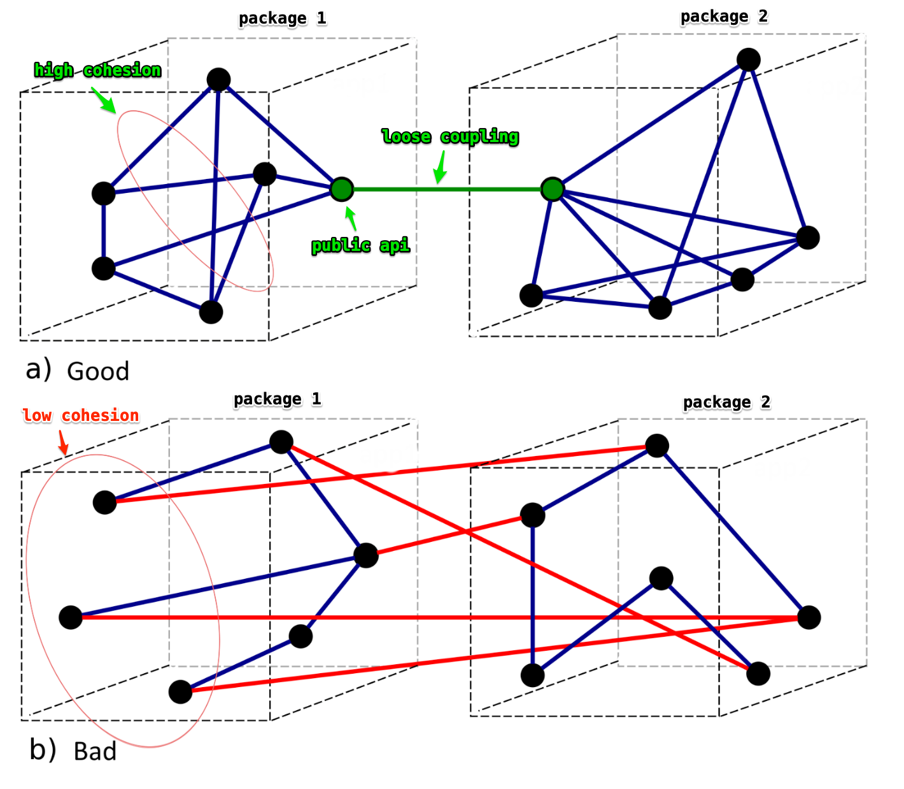

<!-- _class: title -->

<div class="tag">Dresden.rb · 28.05.2026</div>

# Packwerk

<div class="subtitle">Was ist das und wie nutzen wir es?</div>
<div class="speaker">Steve Reinke & Christoph Wagner - webit! Gesellschaft für neue Medien mbH</div>

<div class="deco"><span></span><span></span></div>

---

## Agenda

1. **Motivation**
2. **Packwerk**
3. **Einsatz bei webit!**
4. **Fazit**

---

<!-- _class: section -->
<!-- header: "Motivation" -->

# Motivation

## Der Schmerz eines wachsenden Monolithen

---

<!-- _class: quote -->

> # Hast du schon mal eine Codeänderung gemacht, bei der plötzlich Dinge umgefallen sind, mit denen du nichts zu tun haben wolltest?

---



---

## Rails gibt Struktur — aber nicht genug

> Rails gibt euch eine Struktur für Dateien.
> Wer mit wem reden darf — das regelt niemand.

MVC und Convention over Configuration lösen nicht das Problem von Abhängigkeiten.

---

## Warum nicht einfach Disziplin?

- Menschen vergessen Regeln.
- Neue Entwickler kennen sie nicht.
- Zeitdruck gewinnt immer.

> Code Reviews skalieren schlechter als automatische Regeln.

→ Wie macht man Abhängigkeiten **sichtbar — und Regeln durchsetzbar?**

---

<!-- _class: section -->
<!-- header: "Packwerk" -->

# Packwerk

## Was ist es, wie funktioniert es?

---

## Woher kommt Packwerk?

Shopify entwickelte es für ihr großes monolithisches System und veröffentlichte es im September 2020.

> Packwerk ist ein Linter für Architekturgrenzen.

---

## Drei Kernkonzepte

- **Paket** — Verzeichnis mit `package.yml`, definiert eine (fachliche) Einheit `packs/billing`, `packs/users`, …
- **Privacy** — Klassen können `private` sein: nur das eigene Paket darf sie nutzen.
- **Dependency** — Ein Paket deklariert explizit, welche anderen Pakete es nutzen darf.

---

## Das Werkzeug

- Statischer Analyse-Checker
  - liest Code, meldet Verstöße
  - keine Runtime-Magie, kein Framework-Lock-in

> Packwerk bindet den Code nicht enger an Rails — und auch nicht an Packwerk selbst.

- **`package_todo.yml`**
  - Bestehende Verstöße können dokumentiert werden, statt sofort behoben — pragmatischer Einstieg in Legacy-Projekten.

---

## Einordnung im Vergleich

| Ansatz | Vorteil | Nachteil |
|--------|---------|----------|
| Rails-Monolith | Schnell | Entropie |
| Modulith | Leichte Boundary Enforcement | Paketaufteilung |
| Rails Engines | Stärkere Isolation | Schwergewichtiger |
| Microservices | Klare Grenzen | Operative Hölle, Kommunikationsoverhead |

---

<!-- _class: section -->
<!-- header: "Einsatz bei webit!" -->

# Einsatz bei webit!

## Wie nutzen wir bei webit! Packwerk?

---

## JACK — Ein Beispiel aus der Praxis

JACK ist eine Plattform zur Planung und Auslieferung von Lebensmitteln für Großküchen.

- Packwerk **von Beginn an** im Einsatz
- **23 Pakete** insgesamt
- **5 Domänenpakete:** `order_management`, `portioning`, `commissioning`, `material_tracking`, `logistics`
- je mit Unterpaketen: `domain`, `infrastructure`, `application`, `core_extension`
- **3 Basis-Pakete:** `core`, `architecture_core`, `events`

---

## Aufbau eines Domänenpakets

Packwerk erzwingt Grenzen zwischen Domänen — und zwischen den **Schichten innerhalb** einer Domäne:

```
lib/packages/portioning/
├── public/           ← sichtbar für alle anderen Pakete
├── domain/           ← eigenes Paket · visible_to: [portioning]
├── infrastructure/   ← eigenes Paket · visible_to: [portioning]
├── application/      ← eigenes Paket · visible_to: [portioning]
└── core_extension/   ← geteilte Basistypen für andere Pakete
```

---

<!-- _class: quote -->

> # Packwerk löst keine schlechte Architektur.
> # Es macht schlechte Architektur sichtbar.

---

## Was hat gut funktioniert?

- Lose Kopplung der Domänenaspekte durch Pakete mit klar definierter public API
- Strikte Architekturregeln durch Unterpakete — Domänenschicht frei von externen Abhängigkeiten (DDD)
- Aufgaben gut parallelisierbar durch klare Paketgrenzen
- Refactoring innerhalb eines Pakets ohne Außenwirkung — dank stabiler public API

---

## Welchen Herausforderungen sind wir begegnet?

- Die richtige Paketstruktur und -größe zu finden ist nicht trivial — falsche Einteilung kostet beim Umschneiden Zeit
- Teamkonsens zu Architekturregeln notwendig — fehlendes Wissen erzeugt Reibungsverluste
- UI-Aggregation über mehrere Pakete hinweg aufwändiger als im klassischen Monolithen

---

<!-- _class: section -->
<!-- header: "Fazit" -->

# Fazit

## Wann lohnt sich der Einsatz von Packwerk?

---

## Wann lohnt sich Packwerk?

**Ja, wenn:**
- Langfristige Lebensdauer eines Rails-Monolithen, vermutlich insbesondere, wenn mehrere Teams daran arbeiten
- Wenn Architektur-Smells auffallen, z.B. durch [Rubrowser](https://github.com/emad-elsaid/rubrowser)
- Wenn langfristig Services angestrebt werden, aber der Zeitpunkt noch nicht gekommen ist

**Eher nicht, wenn:**
- Projekte in früher Phase — erst das Produkt finden, dann Struktur

---

<!-- _class: quote -->

> # KI schreibt Code schneller, als Menschen ihn in der Tiefe reviewen und prüfen können. 
> # Gut strukturierter Code macht das leichter. Packwerk setzt diese Struktur durch.

---

<!-- _class: quote -->
<!-- header: "" -->

# Danke für eure Aufmerksamkeit.
# Gibt es Fragen?

---

Quellen:

GitHub: [Shopify/packwerk](https://github.com/Shopify/packwerk)
Diagramm: [Packwerk-Doku](https://github.com/Shopify/packwerk/blob/main/docs/cohesion.png)
Blog: [Shopify Engineering Blog](https://shopify.engineering/enforcing-modularity-rails-apps-packwerk)
